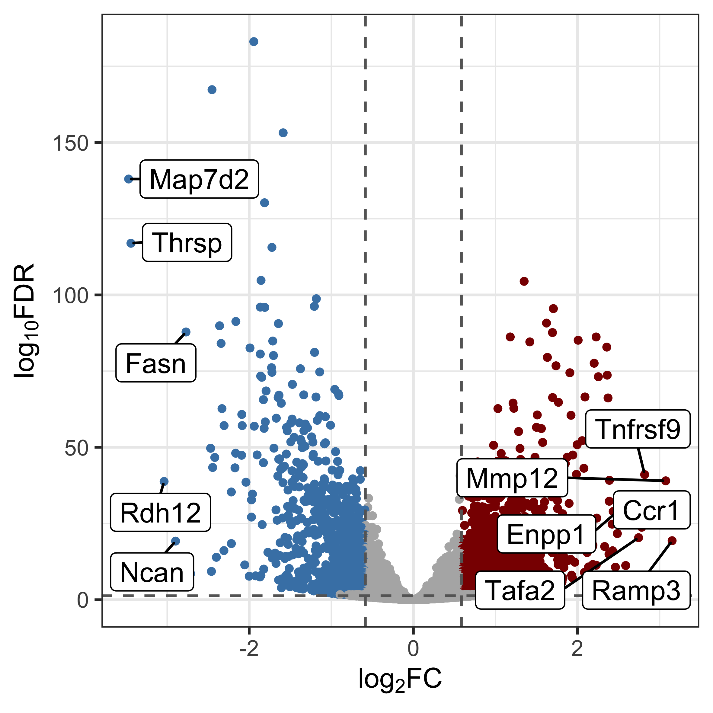
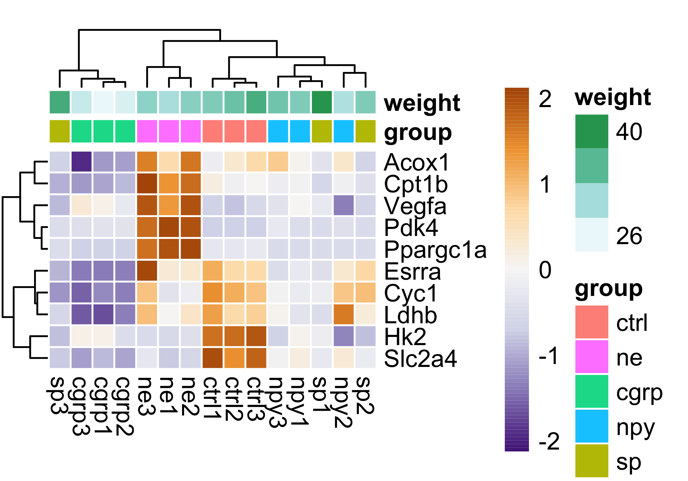
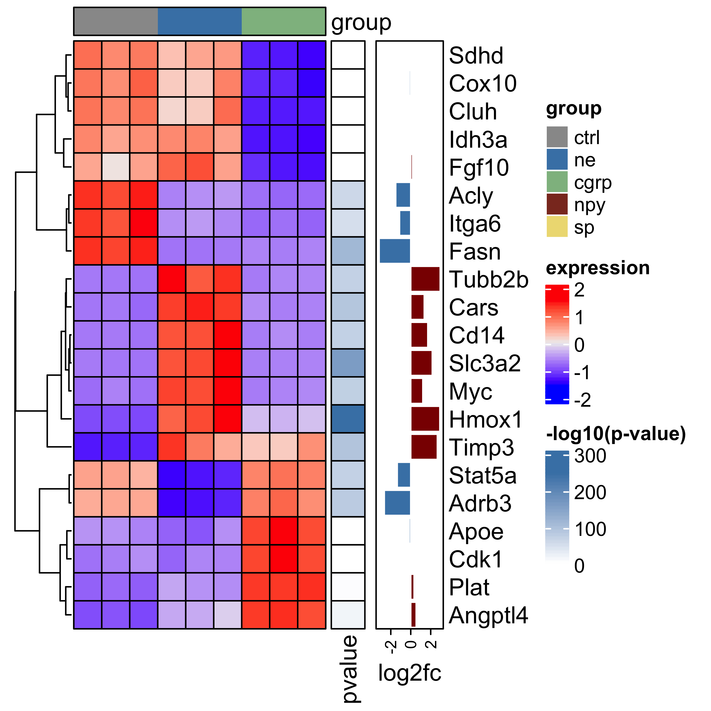
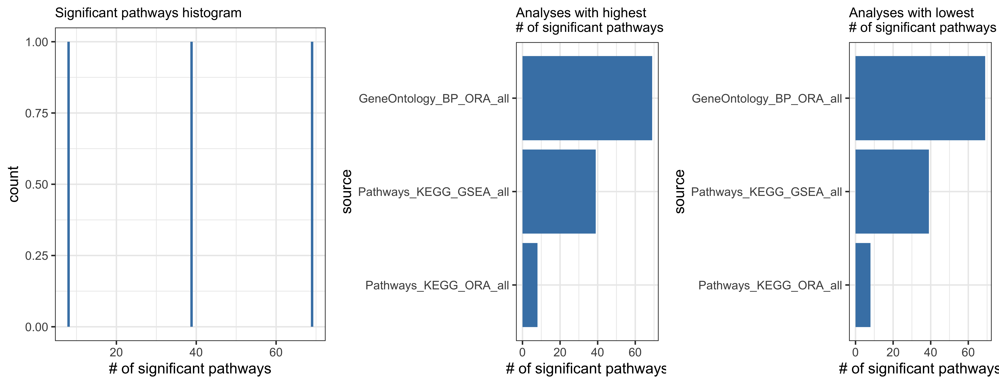
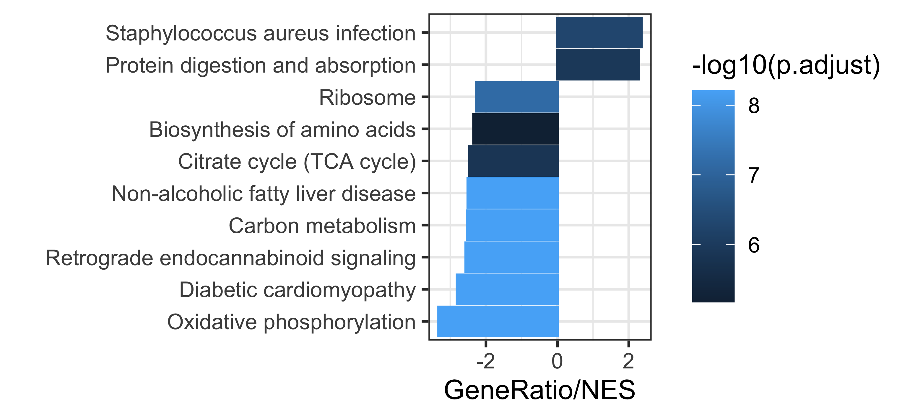
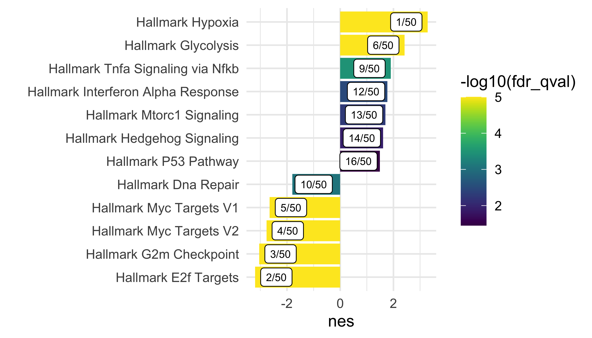
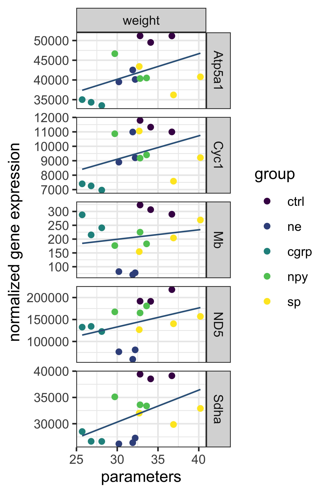

# RNASeq visualization 

Collection of scripts for creating publication ready graph for bulk RNASeq and pathway analysis. Contains several types of graph with included default parameters to simplify graph creation and export. Currently this project exists as a collection scripts and a run file which will contain your code to generate graphs. In the future, this will be transformed into R package instead.

## How to use
For now the easiest way is to clone the project, change the entries in `paths.json` file to point to the relevant data and desired output directory, specify analysis and export parameters in the `config.json` file, place the code for the graphs in the `run.R` file and execute. Supplied `run.R` file contains examples for all graph types as well as their export.

## Input
Loacation of input files is specified in `paths.json` file either as a relative or an absolute path. Scripts accept both comma- and tab-delimited text files and xlsx files in some instances.  If the file for a particular analysis is not available, the entry in the `paths.json` file can be deleted or left as empty string. Paths to gene expression files usually point to a specific file (with the exception of `cuffdiff` data), whereas paths to pathway analysis files are specified as a directory containing individual analyses. See example `data` for more details.

### Expression data
Must contain some gene ID column (Ensemble, Entrez or Symbol) and one column of normalized gene expression for each sample. Column names with samples have to match the metadata.

### Differential expression data
Should contain gene ID column, some measure of expression level for MA plots (eg. baseMean from DESeq), a column for log2(fold-change) and columns with raw and adjusted pvalues for volcano plots, heatmaps etc.

### Metadata
Must contain columns for sample names and group

### DESeq2 dds objects
Exported dds object with `saveRDS` after running `DESeq()` function.

### Cuffdiff analysis
Path to directory where `cufdiff` results are stored.

### GSEA pathway analysis
Results of GSEA pathway analysis, script only makes use of summary results present in `gsea_report_for_*.tsv` files. Files can be organized in subdirectories, the script will scan them recursively and will add the directory path as a column in the final data frame.

### Clusterprofiler pathway analysis
This scripts processes `csv` output files from [clusterProfiler report generator](https://github.com/icervenka/clusterprofiler_reports_snakemake).

### AmiGO Gene Ontology analysis
[AmiGO](http://amigo.geneontology.org/amigo) offers hierarchical organization for differentially regulated pathways using Gene Ontology. In order to take advantage of this, results need to be saved in `json` format which preserves this information.

### Qiagen IPA analysis
Processes ouput from [IPA report generator](https://github.com/icervenka/ipa_reports_snakemake). To learn more about IPA please visit [Qiagen website](https://digitalinsights.qiagen.com/products-overview/discovery-insights-portfolio/analysis-and-visualization/qiagen-ipa/).

### Dire (dcode.org) transcription factor analysis
Processing of output from [dire](https://dire.dcode.org/) transcription factor analysis. Accepts also xlsx files. Must contain `Occurence` and `Importance` columns. For data in xlsx file format, sheet name has to be specified in `params` section of `paths.json` file if different than default "Sheet1". 

### Gene lists
Json file containing custom gene list to be used in plots throughout the analysis. Gene names/IDs are case sensitive and must match the appropriate column in your expression data or differential expression data. See `data/gene_lists.json` for example.

### Pathway lists
Json file containg lists of patways to plot in pathway barplots or scatterplots. Pathways can be either specified by their full name (case sensitive), or by rank they were assigned during analysis. data. See `data/pathway_lists.json` for example.

## Output
Directory, where the resulting graphs would be saved, specified in `paths.json` file.

## Config/Parameters
Specified in `config.json` file in the root directory. Following configurations are available:

- **order of the group/condition levels** in the metadata file. By default group levels are ordered alphabetically. Influences the order in which groups appear in certain plots such as heatmap.
- **GSEA cutoff value for FDR**. By default, pathways with FDR lower than 0.25 are considered significant and when importing GSEA files, non-significant pathways will be discarded. If you want to keep all the pathways and then filter later in the analysis workflow, you set the parameter to 1.
- **file name pattern** for reading clusterProfiler pathway files. By specifying the pattern, you can read only subset of files, eg. particular type of analysis or only specific knowledgebase. 
- **plot export parameters** contain image types, dpi, basenames, units and sizes for export of individual plots. You can add your own custom export types as long as the `graph_type` is unique. 

## Supported Graphs

### PCA plots

### MA plot

### Volcano plots

### Heatmaps

### Dire transcription factor plots

### Pathway analysis plots

#### Pathway meta-analysis

#### Pathways bargraph

#### Pathways bargraph with ranking

#### Pathways volcano plot

### Plots for comparing datasets

#### Parameter correlation

#### Scatterplot of log2(fold-changes) of two datasets

#### Venn diagram

## Required packages

List of required packages can be found in `scripts/load_packages.R` file. 

## Issues
- Venn diagram function takes parameters for plot export as function arguments instead of calling ggsave functions
- GSEA MSigDb pathways could use the name prettifier function
- pheatmap and ComplexHeatmap package can't use last_plot() function from ggplot2 package,
the created plot has to be piped to the ggsave_param(_wrapper) functions
- gene list for heatmaps can't be NULL